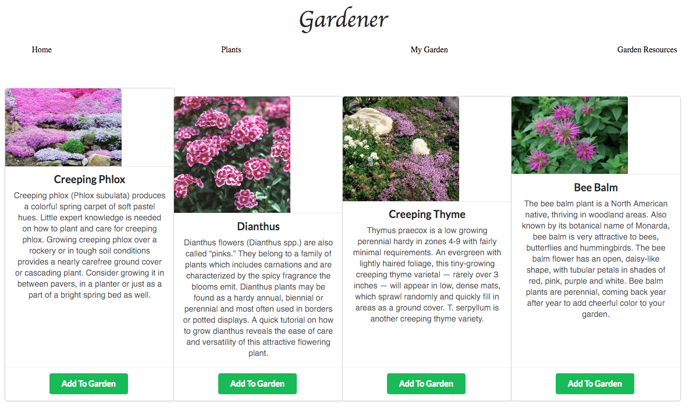

# Gardener 

Gardener is an application that helps users choose plants that grow well in their agriculture zone. The user then can add each plant to their own 'garden' page as well as create new plants.

## Getting Started

Fork and clone this repo. 
cd into the folder then cd into the 'gardener' folder.

### Installing
Install npm-

Once you are in the gardener folder run npm install.

Hosting app locally- 

in the gardener folder run npm start in the CLI.

## Built With

* [React](https://reactjs.org/docs/getting-started.html) - The web framework used

